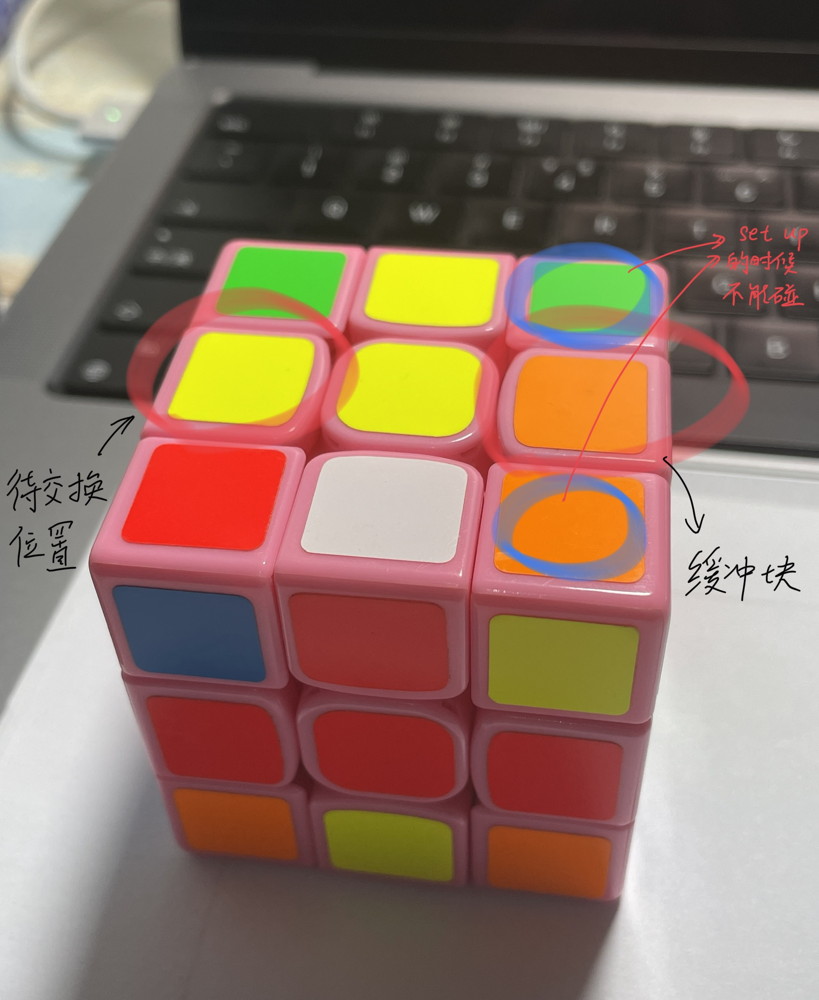
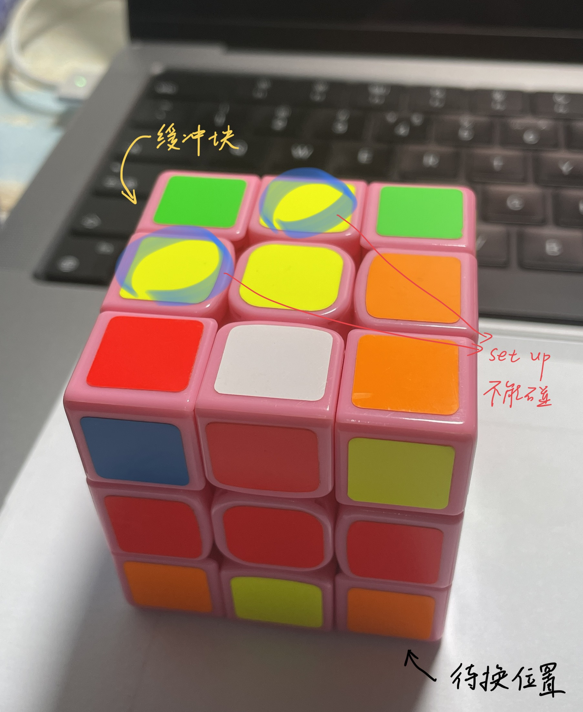

1. 预备知识
棱块缓冲位置：B&M

角块缓冲位置：A&E&R

棱块交换公式(经典对棱交换)
R U R' U' R' F R2 U' R' U' R U R' F'
上左下右 下压上上右下右 上左下推

角块交换公式
R U' R' U' R U R' F' R U R' U' R' F R
上右下右 上左下推 上左下右 下压上

奇偶校验公式(非对棱交换)
R U' R' U' R U R D R' U' R D' R' U2 R' U'
上右下右 上左上(右) 下右上(左) 下右右下右

2. 编码
编码步骤：从缓冲位置开始，根据颜色寻找其物理位置，如此循环。

3. 小循环
棱块 正常是11个编码 不能有B/M
角块 正常是7个编码 不能有A/R/E
注意：
每有一个块已复原，所需编码数-1
遇到小循环，找一个没用过的块(如D)，放到缓冲块去，DxxxD/E作为小循环的内容。
每有一个小循环，所需编码数+1

4. 奇偶校验
棱和角的编码数量的奇偶性是相同的。若均为奇数，则需要奇偶校验。

附录 setup方法

► 棱块setup方法

A: l2 D' l2
B: 缓冲块（编码中不可出现）
C: l2 D l2
D: 不需要setup
E: L d' L
F: d' L
G: L' d' L
H: d L'
I: l D' L2
J: d2 L
K: l D L2
L: L'
M: 缓冲块（编码中不可出现）
N: d L
O: D' l D L2
P: d' L'
Q: l' D L2
R: L
S: l' D' L2
T: d2 L'
U: D' L2
V: D2 L2
W: D L2
X: L2

► 角块setup方法

A: 缓冲块（编码中不可出现）
B: R2
C: F2 D
D: F2
E: 缓冲块（编码中不可出现）
F: F' D
G: F'
H: D' R
I: F R'
J: R'
K: F' R'
L: F2 R'
M: F
N: R' F
O: R2 F
P: R F
Q: R D'
R: 缓冲块（编码中不可出现）
S: D F'
T: R
U: D
V: 不用setup
W: D'
X: D2

> 更多信息请参考: https://jperm.net/bld